# Architecture

This page shows how the gnap.net packages fit together and how the GNAP flows run
through them. The diagrams are [Mermaid](https://mermaid.js.org/) and render directly
on GitHub. For the protocol background read [GNAP for Dummies](gnap-for-dummies.md);
for the security analysis, the [threat model](threat-model.md).

## Contents

1. [Packages and dependencies](#1-packages-and-dependencies)
2. [Components at runtime](#2-components-at-runtime)
3. [Inside the authorization server](#3-inside-the-authorization-server)
4. [Flow: redirect interaction with finish callback](#4-flow-redirect-interaction-with-finish-callback)
5. [Flow: user code](#5-flow-user-code)
6. [Flow: push finish](#6-flow-push-finish)
7. [Flow: policy approval without interaction](#7-flow-policy-approval-without-interaction)
8. [Flow: calling the resource server (introspection)](#8-flow-calling-the-resource-server-introspection)
9. [Flow: RS-first discovery](#9-flow-rs-first-discovery)
10. [Flow: token rotation, key rotation, revocation](#10-flow-token-rotation-key-rotation-revocation)
11. [Grant state machine](#11-grant-state-machine)
12. [The httpsig key proof on every request](#12-the-httpsig-key-proof-on-every-request)

## 1. Packages and dependencies

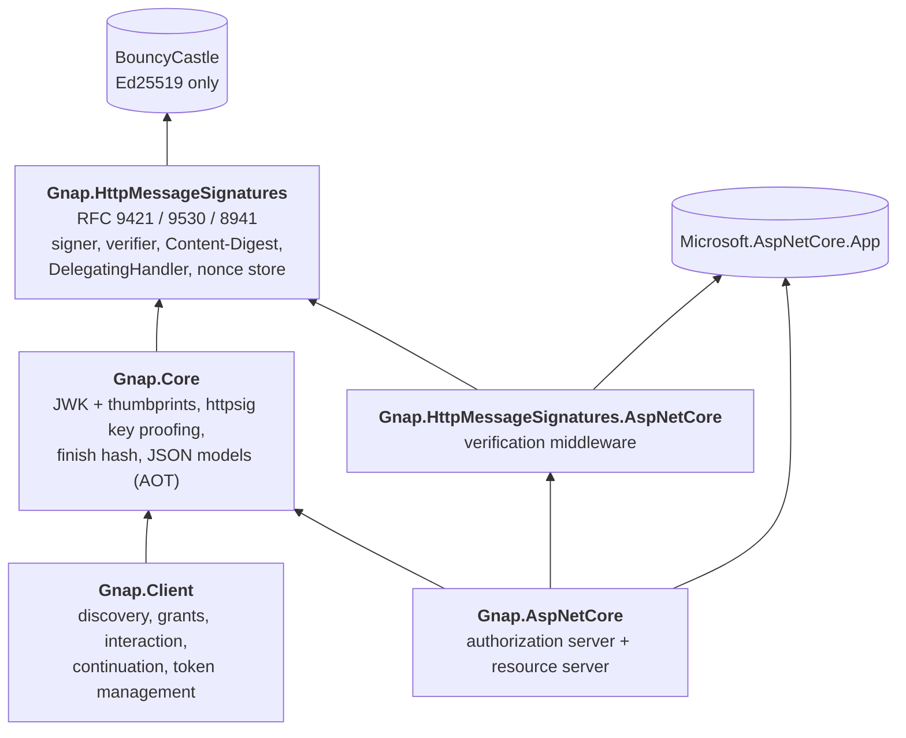

`Gnap.HttpMessageSignatures` has no GNAP knowledge and can be used on its own.
`Gnap.Core` and `Gnap.Client` are trimming- and Native-AOT-compatible and have no
ASP.NET Core dependency.

## 2. Components at runtime

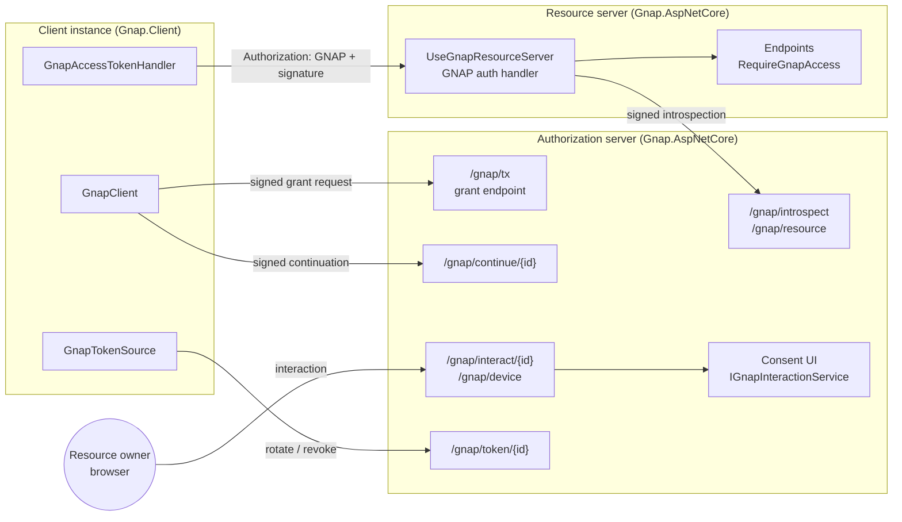

Every arrow from the client and the RS to the AS is an HTTP request signed with
RFC 9421 (`httpsig` key proofing); the AS verifies each one against the key the
grant or the resource server registration is bound to.

## 3. Inside the authorization server

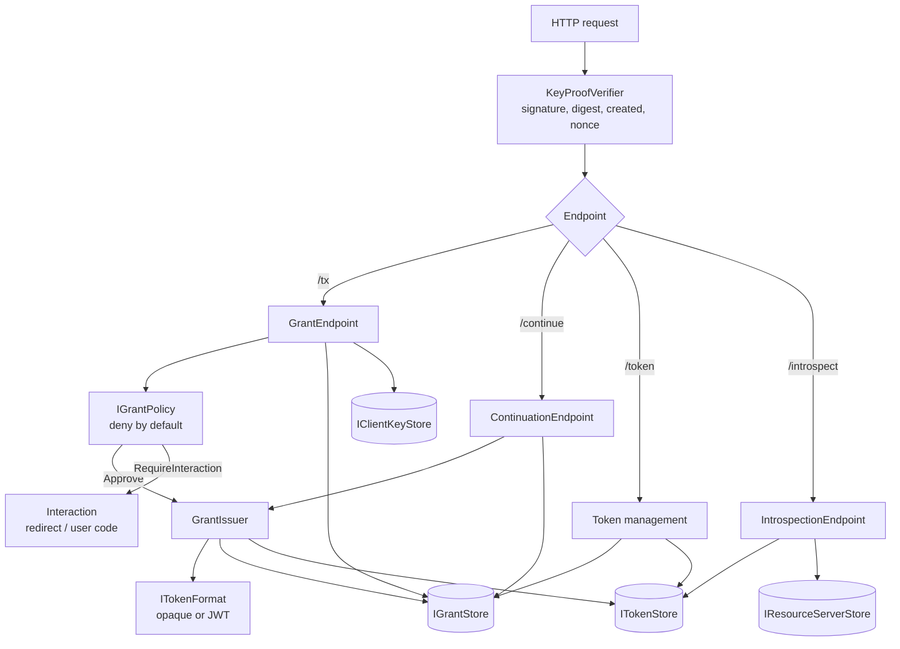

All stores, the policy, the token format and the interaction page are interfaces
registered in DI with in-memory defaults; the example AS replaces the stores with
EF Core.

## 4. Flow: redirect interaction with finish callback

The flow of a web application (RFC 9635 §2, §4.1.1, §4.2.1, §5.1).

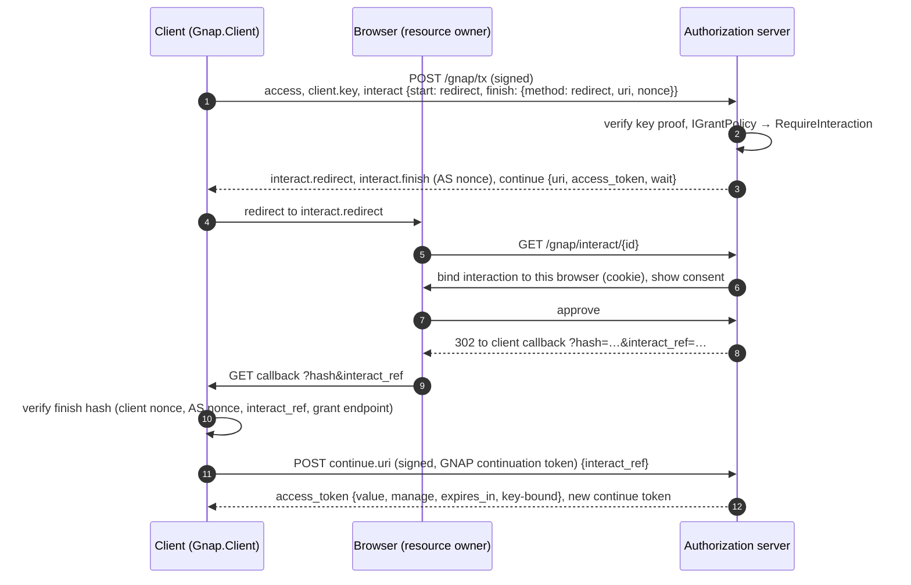

## 5. Flow: user code

For devices without a browser (RFC 9635 §4.1.2, §4.1.3). The client polls.

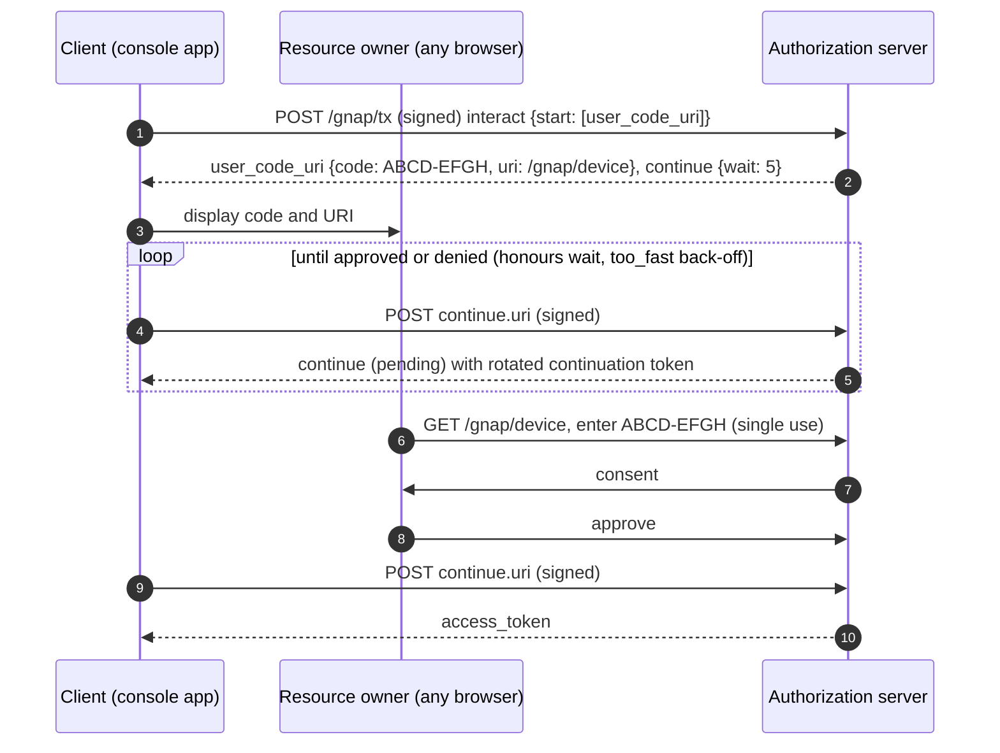

## 6. Flow: push finish

The AS notifies the client server-to-server instead of through the browser
(RFC 9635 §4.2.2).

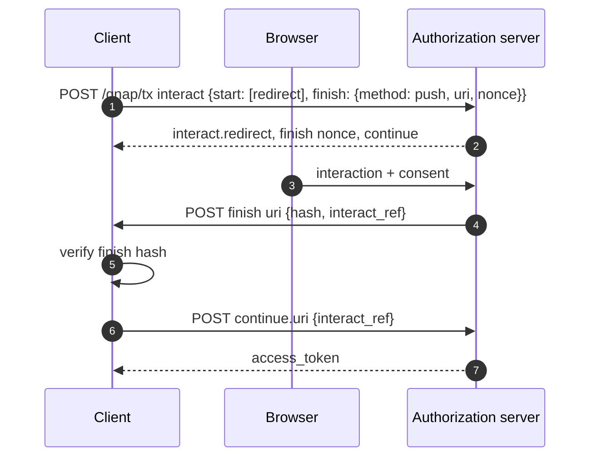

## 7. Flow: policy approval without interaction

A registered client instance (e.g. a service) can be approved by the policy directly;
then the first response already carries the token. (Polling for a pending decision is
shown in flow 5.)

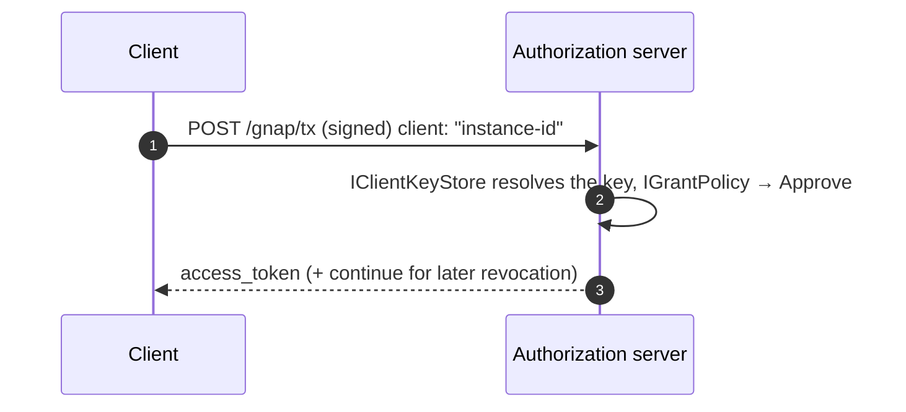

## 8. Flow: calling the resource server (introspection)

RFC 9635 §7.2, §7.3.1 and RFC 9767 §3.3.

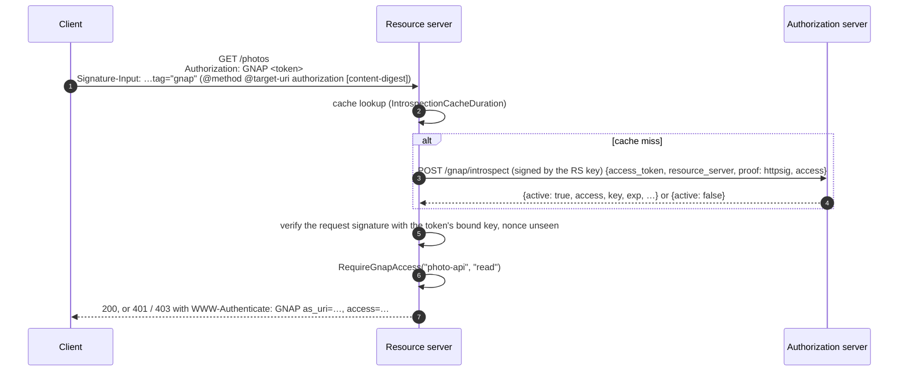

With JWT tokens (`UseJwtTokens`) or a co-hosted AS (`UseLocalTokenStore`) the
introspection round-trip is replaced by local validation; the key-proof check stays.

## 9. Flow: RS-first discovery

The client starts at the resource and learns where to get a token (RFC 9635 §9.2,
RFC 9767 §3.4).

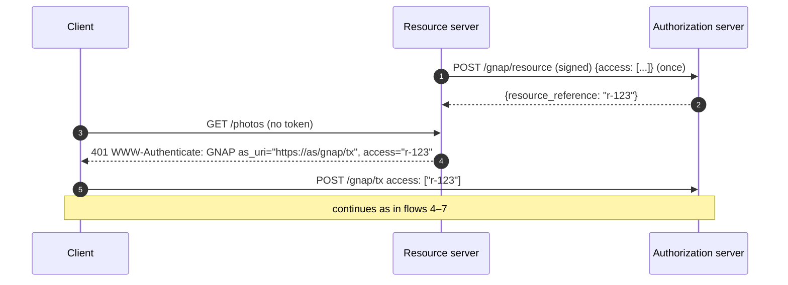

## 10. Flow: token rotation, key rotation, revocation

RFC 9635 §6.1, §6.1.2, §6.2 and §5.4. `GnapTokenSource` rotates automatically on
expiry.

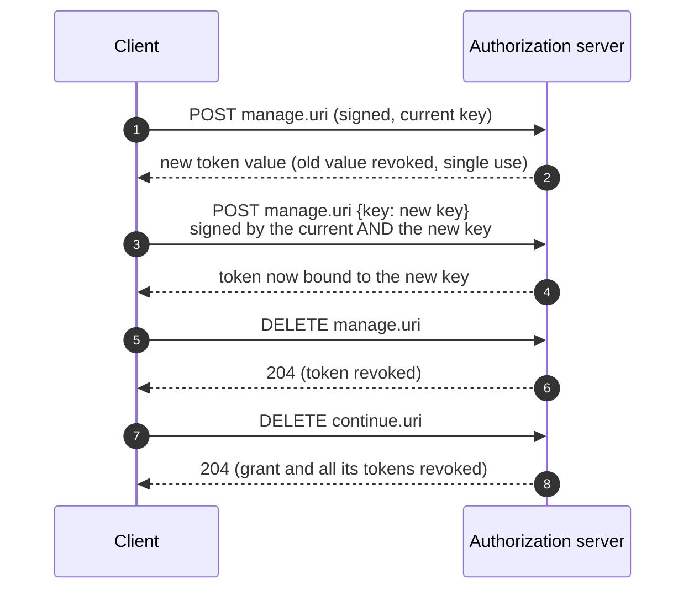

## 11. Grant state machine

`GrantRecord.TransitionTo` enforces the RFC 9635 §1.5 states; illegal transitions
throw.

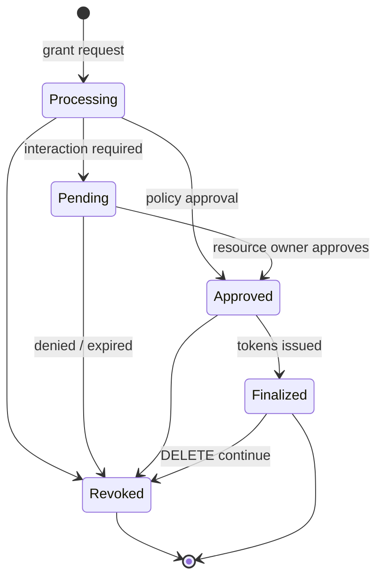

## 12. The httpsig key proof on every request

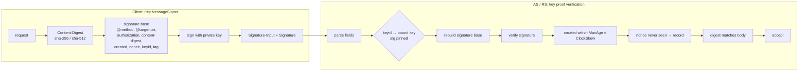

A failure at any step produces the same generic error response; the precise reason is
logged on the server only (no oracle).
