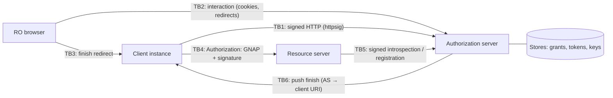

# Threat model and operator security notes

A short STRIDE analysis of gnap.net: what the libraries defend against, what they
deliberately leave to the application, and what operators must configure. Report
vulnerabilities as described in [SECURITY.md](../SECURITY.md).

## Contents

1. [Scope and assets](#1-scope-and-assets)
2. [Trust boundaries](#2-trust-boundaries)
3. [STRIDE](#3-stride)
4. [Operator checklist](#4-operator-checklist)
5. [Known limitations](#5-known-limitations)

## 1. Scope and assets

In scope: the five packages (`Gnap.HttpMessageSignatures`,
`Gnap.HttpMessageSignatures.AspNetCore`, `Gnap.Core`, `Gnap.Client`,
`Gnap.AspNetCore`) as used to build a GNAP client, authorization server (AS) and
resource server (RS). The example applications are demos and not hardened.

| Asset | Where it lives | Impact if compromised |
|---|---|---|
| Client private keys | client process (`GnapClientKey`) | Impersonation of the client instance, use of all its key-bound tokens |
| RS private key | RS (`SigningKey`) | Introspection of arbitrary tokens, resource set registration |
| AS JWT signing key (`JwtTokenFormat`) | AS | Forging access tokens for every RS that validates JWTs locally |
| Access tokens | client, AS token store, RS cache | Key-bound: useless without the key. Bearer: full use until expiry |
| Continuation / management tokens | client, AS grant store | Key-bound to the client key; controls the grant/token lifecycle |
| Grant and interaction state | AS stores | Approving or hijacking pending grants |
| Resource owner session | browser ↔ AS | Approving grants in the RO's name |

## 2. Trust boundaries

Everything crossing TB1–TB6 is attacker-controllable. The stores are trusted: whoever
can write to them controls the AS.

## 3. STRIDE

### Spoofing

| Threat | Mitigation |
|---|---|
| Client impersonation at the AS | Every AS request carries an RFC 9421 `httpsig` key proof (RFC 9635 §7.3.1); continuation and management additionally require the **same key** as the grant. Private JWKs sent as client keys are rejected. |
| Token theft and replay at the RS | Tokens are key-bound by default; the RS requires a signature by the bound key covering `@method`, `@target-uri`, `authorization` and `content-digest`. Bearer tokens must be enabled explicitly on both AS and RS. |
| Forged finish callback (redirect/push) | The client verifies the finish hash over client nonce, AS nonce, `interact_ref` and grant endpoint in constant time; `interact_ref` is single-use at the AS. |
| RS impersonation at the introspection endpoint | Introspection and resource registration require a key proof by a pre-registered RS key (`IResourceServerStore`); otherwise `invalid_client`. |
| Algorithm confusion | The verifier pins `alg` to the key type, rejects alg/key mismatches and `alg` downgrades; HMAC is only used where configured explicitly. |

### Tampering

| Threat | Mitigation |
|---|---|
| Body modification in transit | `Content-Digest` (RFC 9530, `sha-256`/`sha-512`) is covered by the signature and checked against the buffered body. |
| Header reordering / canonicalization tricks | Signature base built strictly per RFC 9421 (tested against all Appendix B vectors and property tests). |
| JWT token tampering | `JwtTokenFormat` signs tokens; the RS validates signature, issuer and expiry; forgery tests cover unsigned tokens, foreign signing keys, wrong issuers, escalated rights and rebound keys. |
| Grant state manipulation | `GrantRecord.TransitionTo` enforces the RFC 9635 §1.5 state machine; illegal transitions throw. |

### Repudiation

| Threat | Mitigation |
|---|---|
| Client denies having made a request | Requests are signed with the client key; signatures can be logged. |
| Missing audit trail | The AS and RS log the concrete reason of every rejection (`ILogger`). **Operators** must retain these logs; the libraries do not persist an audit log. |

### Information disclosure

| Threat | Mitigation |
|---|---|
| Error oracles (which check failed, whether a grant exists) | Fixed error descriptions per error code; unknown grants and foreign, rotated or expired continuation tokens give byte-identical responses; introspection answers only `{"active":false}` for every negative case. |
| Timing side channels on secrets | The finish hash is compared in constant time; the AS stores continuation and management tokens only as hashes and compares them in constant time. |
| Token leakage through logs and URLs | Tokens are sent in headers/bodies, never in query strings; do not log `Authorization` headers (operator). |
| Interaction hijacking via leaked interaction URI | Interactions bind to the first browser that opens them (HttpOnly cookie); user codes are single-use and expire (`InteractionLifetime`). |

### Denial of service

| Threat | Mitigation |
|---|---|
| Large request bodies | `MaxRequestBodySize` (AS 64 KiB, RS 1 MiB) bounds buffering for digest verification. |
| Nonce store growth | Nonces are kept only for the `created + MaxAge + ClockSkew` window and recorded only **after** a valid signature (forged requests cannot fill the store or burn nonces). |
| Introspection amplification | The RS caches positive and negative results (`IntrospectionCacheDuration`, `NegativeCacheDuration`, bounded `IntrospectionCacheSize`). |
| Aggressive polling | `wait` is enforced; early polls get `too_fast`. |
| User-code brute force | Codes have ~34 bits of entropy and expire; **no attempt limiting** in the library — add rate limiting (operator). |

### Elevation of privilege

| Threat | Mitigation |
|---|---|
| Client obtains more access than approved | Deny-by-default `IGrantPolicy`; tokens carry exactly the approved `access`; `ApprovalFits` checks approvals against the request. |
| Token used for a different resource | `RequireGnapAccess(type, action)` authorizes each endpoint; introspection with `access` returns inactive if the token does not carry it. |
| Key rotation abuse | Rotating the bound key requires signatures by the current **and** the new key, the new signature covering the old one. |
| Push finish as SSRF vector | The AS POSTs to a client-chosen URI. Restrict `interact.finish.uri` in your policy or egress configuration (operator). |

## 4. Operator checklist

**All deployments**

- [ ] Serve AS and RS over HTTPS only; terminate TLS at a proxy you control.
- [ ] Behind a reverse proxy set `PublicOrigin` (AS) or configure forwarded headers —
      the grant endpoint URI enters the finish hash and `@target-uri` must match what
      the client signed.
- [ ] Keep clocks synchronized (NTP); signatures are rejected outside
      `SignatureMaxAge ± SignatureClockSkew`.
- [ ] Keep `RequireSignatureNonce = true`. With more than one instance, register a
      shared, atomic `INonceStore` (e.g. Redis `SET NX PX`) — the in-memory store does
      not protect against replays across instances.
- [ ] Do not log `Authorization`, `Signature` or token values; do retain rejection logs.

**Authorization server**

- [ ] Replace the in-memory stores with persistent ones (`IGrantStore`, `ITokenStore`,
      `IClientKeyStore`, `IResourceServerStore`, `IResourceSetStore`) for anything
      beyond a single process.
- [ ] Write an explicit `IGrantPolicy`; never approve unknown clients without
      interaction.
- [ ] Authenticate the resource owner on the consent page (the library leaves RO
      authentication to the application) and protect it against CSRF (Razor Pages
      antiforgery is on by default).
- [ ] Leave `AllowBearerTokens = false` unless a client cannot hold a key.
- [ ] Rate-limit `/gnap/device` and `/gnap/tx` (ASP.NET Core rate limiting middleware).
- [ ] Restrict push finish URIs if the AS can reach internal networks.
- [ ] Protect the JWT signing key (Key Vault/HSM) and plan its rotation; the RS is
      configured with the AS public key.
- [ ] Choose token lifetimes (`AccessTokenLifetime`) to fit your revocation latency.

**Resource server**

- [ ] Keep the RS private key out of source control; register only its public key at the AS.
- [ ] Introspection caching delays revocation by up to `IntrospectionCacheDuration`;
      shorten it or call `GnapIntrospectionCache.Invalidate` where that matters.
- [ ] Leave `AllowBearerTokens = false` unless required.

**Client**

- [ ] Store the client private key in a secret store; rotate it with the key rotation API.
- [ ] Use a fresh client nonce per grant (default) and verify the finish hash (default).
- [ ] For web clients, bind the pending grant to the user's session (the step-wise API
      returns state you must keep server-side).

## 5. Known limitations

- Only the `httpsig` proofing method; `mtls`, `jwsd` and `jws` are not implemented.
- No grant modification (`PATCH`), no token audiences, no token chaining (RFC 9767 §4).
- No push-based revocation from AS to RS.
- Packages are repository-signed by nuget.org; they are not author-signed.

See also the "What is not covered" sections of the
[AS](gnap-authorization-server.md#11-what-is-not-covered-yet),
[RS](gnap-resource-server.md#9-what-is-not-covered-yet) and
[client](gnap-client.md) guides, and the conformance checklist in [interop.md](interop.md).
